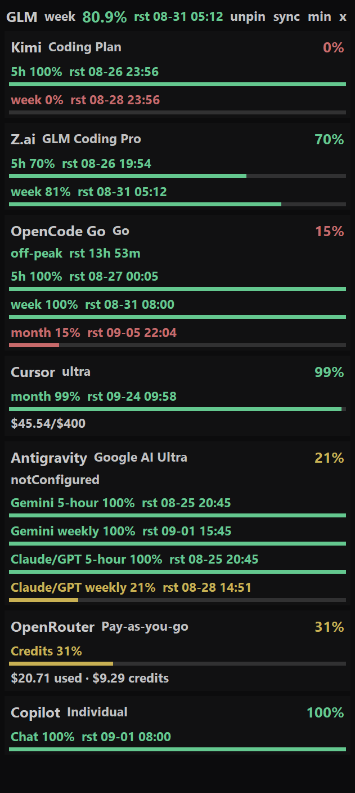

# Quota Floater



Always-on-top strip of **official remaining quota**. Reuses Token Monitor MIT probes.
Does not log in, scan tokscale logs, or copy secrets into git.

Agent-first: [docs/AGENT.md](docs/AGENT.md) · setup & debug: [docs/SETUP.md](docs/SETUP.md) · drop-in agent skill: [skill/quota-floater/SKILL.md](skill/quota-floater/SKILL.md). Do not use the Token Monitor Settings panel.

## Start

Windows: run `start.cmd` from the folder. macOS/Linux: `python3 ui.py`.

## Probe

```
node collect.js
node collect.js --json
```

`--json` prints `snapshot.json` (no secrets) on stdout. Missing provider = no local credential (skipped). A failed probe keeps last-good windows.

Table:

```
quota.cmd
```

Pi (after `/reload`): `/quota`

## Agent hookup (3 steps)

1. `cd` to this folder.
2. `node collect.js --json`
3. Read `providers[]`. Skip missing ids. Never print secrets.

## UI facts

- DeepSeek / OpenCode Go: `{off-peak|peak}  rst {Xh Ym|Ym|<1m}` (example `off-peak  rst 31m`).
- Card gap **9px** (`5+4`). tk cannot do 9.3.
- Kimi **month** needs website `kimi-auth`. kimi-code OAuth is not enough. Wizard: [docs/WIZARD.md](docs/WIZARD.md).

Claude (Claude Code OAuth or claude.ai `CLAUDE_WEB_COOKIE`) and Codex (`~/.codex/auth.json`) are wired via the vendored upstream `limitCollector.js`. First log-in is a human step — see [docs/SETUP.md](docs/SETUP.md).

## License

Project code: [MIT](LICENSE) (Copyright (c) 2026 Quota Floater authors).

`vendor/tm-shared/` probes come from [Javis603/token-monitor](https://github.com/Javis603/token-monitor) (MIT, Copyright (c) 2026 Javis). Full text: [NOTICE](NOTICE) and `vendor/tm-shared/LICENSE`.

This product is **Quota Floater**. It is not the upstream desktop app.

## Release

Free. MIT. No paywall.

The zip is published on **GitHub Releases**. GitHub Sponsors optional.

Pack (local zip; does not commit):

```
node scripts/pack-release.js
```

or `scripts\pack-release.cmd`. Output: `dist/quota-floater.zip`.

The zip includes `start.cmd`, `quota.cmd`, `collect.js`, `ui.py`, `vendor/`, `docs/`, `LICENSE`, `NOTICE`, and the other run files. It excludes `secrets.json`, `snapshot.json`, `settings.json`, `*.bak`, and `.git`.

Secret scan (must not leak live tokens). From the unpacked zip, these must print nothing:

```
rg -n "eyJ[A-Za-z0-9_-]{20,}"
rg -n "sk-[A-Za-z0-9]{16,}"
```

The pack script runs the same check and refuses the zip on a hit. Bare prefix names (`sk-or-`) and this documentation do not match.

Provider map: [docs/PROVIDERS.md](docs/PROVIDERS.md).
